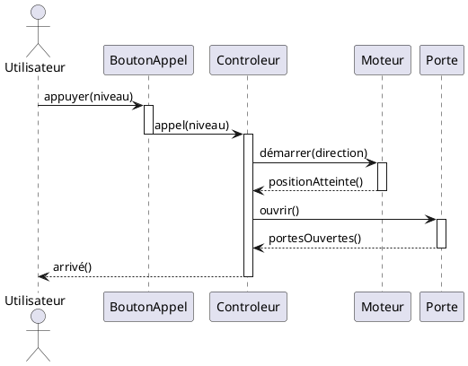

# 📉 Les Diagrammes d'Interaction : Séquence et Collaboration

Les Diagrammes d'Interaction décrivent le **comportement dynamique** du système en se concentrant sur l'échange de messages entre les objets. Ils sont essentiels pour modéliser le *comment* des scénarios complexes.

-----

## 1\. ⏱️ Diagramme de Séquence (Sequence Diagram)

Le Diagramme de Séquence montre les interactions d'un **point de vue temporel**. Le temps s'écoule verticalement de haut en bas.

### Rôle et Contexte

  * **Rôle :** Décrire des **scénarios complexes** avec peu d'objets, en insistant sur l'ordre chronologique des événements.
  * **Limitation :** Il ne rend **pas compte du contexte interne et spatial** des objets (pour cela, on utilise le Diagramme de Collaboration).

### Les Fondamentaux

  * **Objets :** Placé **horizontalement en haut** du diagramme. Ils sont notés de manière soulignée (ex. : `:Ascenseur`).
  * **Ligne de Vie (Lifeline) :** Trait vertical pointillé sous chaque objet, symbolisant la durée de son existence dans le scénario.
  * **Interaction :** Un **comportement dynamique** où un objet envoie un **message** (appel de méthode) à un autre objet, forçant le receveur à s'exécuter.

### Activations et Durée de Vie

Le Diagramme de Séquence montre les **activations** des objets, qui représentent la période pendant laquelle l'objet est actif et exécute une méthode.

  * **Notation :** Un **rectangle fin et vertical** est dessiné sur la ligne de vie de l'objet receveur pour indiquer le début et la fin de son activation.

### Types de Message (PlantUML)

| Type de Message | Sémantique | Notation UML | Exemple PlantUML |
| :--- | :--- | :--- | :--- |
| **Asynchrone** (Flot de Contrôle Plat) | L'expéditeur n'est **pas bloqué** et continue son exécution. | Flèche simple (demi-tête). | `Client -> Serveur : notification()` |
| **Synchrone** (Flot de Contrôle Emboîté) | La séquence emboîtée doit se terminer (réponse reçue) pour que la séquence englobante reprenne le contrôle. | Flèche à **extrémité pleine et triangulaire**. | `Expéditeur -> Receveur : traitement()` |
| **Retour de Procédure** | Réponse explicite du destinataire. Normalement **implicite** (à la fin de l'activation), mais peut être notée pour un retour de paramètre. | Flèche de retour **en pointillés**. | `Receveur --> Expéditeur : résultat` |

-----

### Exercice : Diagramme de Séquence d'un Ascenseur

**Scénario :** Un utilisateur appelle l'ascenseur, l'ascenseur se déplace, puis ouvre ses portes.

-----

## 2\. 🗺️ Diagramme de Collaboration (Collaboration Diagram / Communication Diagram)

Le Diagramme de Collaboration (anciennement Diagramme de Communication) met l'accent sur la **représentation spatiale** des objets et leurs relations.

### Rôle et Structure

  * **Rôle :** Montrer les **rôles joués** par les objets dans un contexte donné. Il insiste sur la **structure** et les formes de communication.
  * **Finalité :** Réaliser une **opération (méthode)** ou un **classificateur (cas d'utilisation, classe)** dans un contexte donné.

### Comportement et Description

La description du comportement dans un Diagramme de Collaboration se fait par l'ajout de **numéros de séquence** sur les messages.

  * **Notation :** Objets (rectangles soulignés) et Liens (lignes simples) sont affichés. Les messages sont numérotés dans l'ordre chronologique sur les liens.

### Types de Description

Le Diagramme de Collaboration permet deux niveaux de description :

1.  **Description Générale (Spécification) :**

      * Décrit le **rôle des classificateurs** et le **rôle des associations**.
      * Une interaction est vue comme une **séquence de messages partiellement ordonnés** échangés entre les rôles des classificateurs.

2.  **Description Spécifique (Instance) :**

      * Décrit une **instance particulière d'interaction**.
      * Montre les **objets** et les **liens** qui se conforment à la spécification.
      * Ajoute les **stimulus** (instances des messages, numérotés) échangés entre ces objets.
