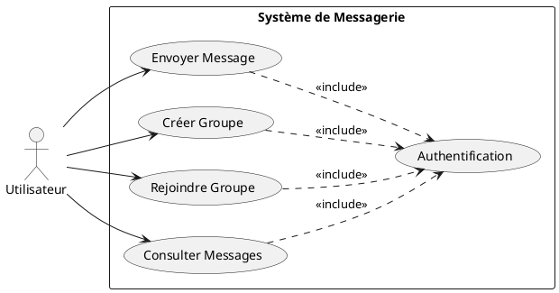
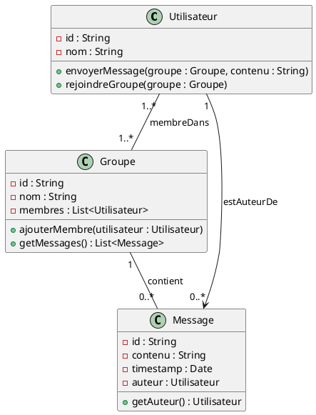
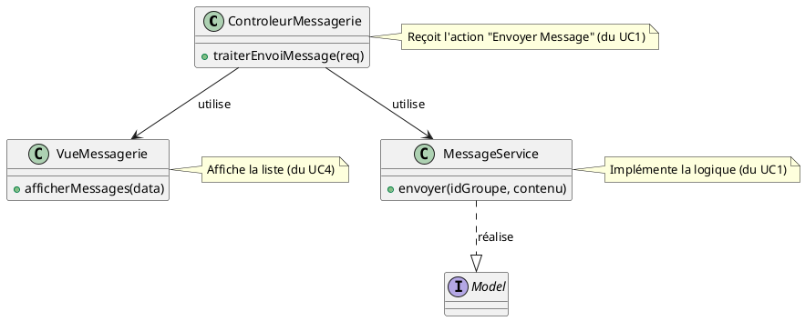

# ✉️ Introduction à l'Architecture Logicielle et à l'Inversion de Dépendance

## Phase 1 : Capture des Besoins avec le Diagramme de Cas d'Utilisation

Commençons par définir les besoins de notre système de messagerie en groupe du point de vue de l'utilisateur.

### Diagramme de Cas d'Utilisation : Système de Messagerie

Notre système simple permet aux utilisateurs d'envoyer des messages dans des groupes.



| Cas d'Utilisation (UC) | Rôle (User Story Simplifiée) |
| :--- | :--- |
| **Envoyer Message** | Permet à l'utilisateur de publier un contenu dans un groupe spécifique. |
| **Créer Groupe** | Permet à l'utilisateur d'initialiser un nouveau canal de discussion. |
| **Rejoindre Groupe** | Permet à l'utilisateur de s'ajouter à un groupe existant. |
| **Consulter Messages** | Permet à l'utilisateur de lire les messages d'un groupe. |
| **Authentification** | **Inclus** dans tous les autres UC ; garantit que l'utilisateur est identifié. |

-----

## Phase 2 : Modélisation Statique avec le Diagramme de Classes

Nous allons maintenant définir les entités nécessaires pour supporter ces cas d'utilisation : l'Utilisateur, le Message et le Groupe.

### Diagramme de Classes : Entités de Messagerie

Ce diagramme montre la structure de nos données (le Modèle).



### Lien entre Cas d'Utilisation et Modèle

> **Lien direct entre un `MessageService` et un groupe de Cas d'Utilisation ?**
>
> Oui, il y a un lien direct. Un **Cas d'Utilisation** (ex. : "Envoyer Message") est réalisé (implémenté) par une collaboration d'objets. En architecture logicielle, c'est souvent un **Service** (`MessageService` ou `GroupeService`) qui orchestre cette collaboration.
>
>   * **Cas d'Utilisation (Rôle) $\rightarrow$ Service (Implémentation) $\rightarrow$ Modèle (Données).**
>
> Le service est la classe qui contient la logique métier nécessaire pour accomplir le Cas d'Utilisation.

-----

## Phase 3 : L'Architecture Modèle-Vue-Contrôleur (MVC)

L'architecture **MVC** est un patron de conception essentiel qui sépare les responsabilités d'une application en trois couches. C'est le principe du **Principe de Responsabilité Unique (SRP)** appliqué à l'architecture.

### Présentation du MVC

| Couche | Rôle | Description |
| :--- | :--- | :--- |
| **Modèle (Model)** | **Logique métier et Données.** | Le cœur de l'application. Gère l'état et la persistance. C'est là que se trouvent nos classes `Utilisateur`, `Message`, `Groupe` et les Services associés. |
| **Vue (View)** | **Interface Utilisateur.** | Responsable de l'affichage des données. Elle ne fait aucune logique métier ; elle reçoit les données du Contrôleur et les affiche. |
| **Contrôleur (Controller)** | **Gestion des Interactions.** | Reçoit les actions de l'utilisateur (requêtes), détermine quel Modèle doit être mis à jour, et choisit quelle Vue afficher en retour. |

### Intégration de notre Modèle dans MVC

Nos classes `Utilisateur`, `Message`, et `Groupe` (définies dans le Diagramme de Classes) font partie du **Modèle**. Le `MessageService` serait également dans cette couche pour gérer la logique "Envoyer Message".



-----

## Phase 4 : Le Problème de la Dépendance et le DIP

Dans une architecture MVC, le Modèle doit généralement stocker les données. Le service (`MessageService`) va dépendre d'un composant de stockage, souvent appelé **Repository**.

### Dépendance Forte (Mauvaise Pratique)

Initialement, on pourrait écrire notre `MessageService` pour qu'il dépende **directement** d'une implémentation concrète de stockage (ex. : `BaseDeDonneesMySQL`).

```plantuml
@startuml
class MessageService {
  - repository : BaseDeDonneesMySQL  // <--- Dépendance concrète !
  + envoyer(idGroupe, contenu) {
    // repository.sauvegarder(message)
  }
}

class BaseDeDonneesMySQL {
  + sauvegarder(message)
}

MessageService --> BaseDeDonneesMySQL
@enduml
```

**Problème :** Si nous décidons de passer à PostgreSQL ou d'utiliser un système de cache, nous devons **modifier le code** du `MessageService`. Le `MessageService` (module de haut niveau, qui contient la logique métier) dépend d'un détail d'implémentation (module de bas niveau, le type de base de données).

### Solution : L'Inversion de Dépendance (Dependency Inversion Principle - DIP)

Le DIP est le dernier principe **SOLID**. Il stipule :

1.  Les modules de haut niveau ne devraient pas dépendre des modules de bas niveau. **Les deux devraient dépendre d'abstractions (Interfaces).**
2.  Les abstractions ne devraient pas dépendre des détails. **Les détails devraient dépendre des abstractions.**

Nous allons insérer une **Interface** (une abstraction) entre le service et le repository.

#### Diagramme : Inversion de Dépendance

```plantuml
@startuml
interface MessageRepository {
  + sauvegarder(message)
  + trouverParId(id)
}

class MessageService {
  - repository : MessageRepository // <--- Dépendance à l'abstraction !
  + envoyer(idGroupe, contenu) {
    // repository.sauvegarder(message)
  }
}

class MySQLRepository implements MessageRepository {
  + sauvegarder(message)
  + trouverParId(id)
}

class CacheRepository implements MessageRepository {
  + sauvegarder(message)
  + trouverParId(id)
}

MessageService .up.> MessageRepository : dépend de
MySQLRepository .up.|> MessageRepository : implémente
CacheRepository .up.|> MessageRepository : implémente
@enduml
```

#### Explication Pédagogique

1.  **L'Abstraction au Milieu :** Nous avons introduit l'interface $<<MessageRepository>>$. Le `MessageService` ne sait plus *comment* la sauvegarde est faite, il sait juste *qu'elle sera faite* (le contrat de l'interface).
2.  **L'Inversion :**
      * Avant : `Service (Haut Niveau) $\rightarrow$ BaseDeDonneesMySQL (Bas Niveau)`.
      * Après : `Service (Haut Niveau) $\rightarrow$ Interface (Abstraction)` et `BaseDeDonneesMySQL (Bas Niveau) $\rightarrow$ Interface (Abstraction)`.
      * **Les flèches se sont "inversées" du point de vue de l'abstraction** : le détail (`MySQLRepository`) dépend maintenant du contrat (`MessageRepository`).
3.  **Bénéfice :** Si vous voulez changer le stockage, vous créez simplement une nouvelle classe (ex. : `CacheRepository`) qui implémente l'interface, sans jamais toucher au `MessageService`. Le système est **Ouvert à l'Extension, Fermé à la Modification (OCP)**.