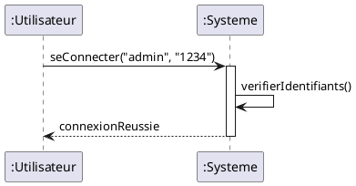

C'est une excellente idée. Passer aux exemples **PlantUML** rend ces fiches directement applicables pour générer vos diagrammes via du code.

Voici vos fiches de référence mises à jour avec la syntaxe PlantUML correspondante.

-----

## 📐 Fiche 1 : Représentation de la Classe et de l'Objet

Ces éléments définissent la structure de votre code PlantUML (`@startuml` ... `@enduml`).

### 1\. La Classe (Le Modèle)

| Élément | Description | Syntaxe PlantUML | Exemple de Code |
| :--- | :--- | :--- | :--- |
| **Général** | Définition de la classe avec accolades `{}` pour le contenu. | `class NomClasse { ... }` | `class Client {` `  - nom : String ` `  # age : int ` `  + getNom() ` `}` |
| **Visibilité** | Définit l'accès aux membres. | **`+`** (Public) **`#`** (Protégé) **`-`** (Privé) | `+ operation()` `- attribut` `# heritage` |
| **Classe Abstraite** | Mot-clé `abstract` devant `class`. | `abstract class Nom` | `abstract class Animal {` `  + {abstract} cri() ` `}` |

### 2\. L'Objet (L'Instance)

| Élément | Description | Syntaxe PlantUML | Exemple de Code |
| :--- | :--- | :--- | :--- |
| **Général** | Mot-clé `object`. On utilise souvent un alias `as` pour simplifier les liens. | `object "nom : Classe" as alias` | `object "c1 : Client" as client1` |
| **État** | Les attributs sont définis entre accolades, sans type, juste avec des valeurs. | `nom = "valeur"` | `object client1 {` `  nom = "Durand" ` `  age = 35 ` `}` |

-----

## 🔗 Fiche 2 : Représentation des Relations Structurelles

Dans PlantUML, le sens des flèches et la forme des pointes définissent la relation.

### 1\. L'Association

| Élément | Description | Syntaxe PlantUML | Exemple de Code |
| :--- | :--- | :--- | :--- |
| **Lien** | Trait simple (double tiret). | `--` ou `-->` (dirigé) | `ClasseA -- ClasseB` |
| **Cardinalités** | Placées entre guillemets de chaque côté du lien. | `"1"`, `"0..1"`, `"*"` | `Client "1" -- "*" Commande` |
| **Rôle et Nom** | Ajoutés après deux points `:` ou sur le lien. | `: Verbe >` | `Livre "*" -- "1" Auteur : est écrit par >` |

### 2\. L'Agrégation (Association par Référence)

| Élément | Description | Syntaxe PlantUML | Exemple de Code |
| :--- | :--- | :--- | :--- |
| **Lien** | Losange vide créé avec la lettre `o`. | `o--` | `Promotion "1" o-- "1..*" Eleve` |

### 3\. La Composition (Association par Valeur)

| Élément | Description | Syntaxe PlantUML | Exemple de Code |
| :--- | :--- | :--- | :--- |
| **Lien** | Losange plein créé avec l'astérisque `*`. | `*--` | `Dossier "1" *-- "1..*" Document` |

### 4\. L'Héritage / Généralisation

| Élément | Description | Syntaxe PlantUML | Exemple de Code |
| :--- | :--- | :--- | :--- |
| **Lien** | Flèche triangulaire définie par `<|`. | `<|--` | `Mammifere <|-- Chien` *(Chien étend Mammifère)* |

-----

## 💬 Fiche 3 : Représentation des Interactions (Séquence)

Ces notations sont spécifiques aux diagrammes de séquence (`@startuml` ... `@enduml`). L'ordre des lignes de code détermine l'ordre chronologique (du haut vers le bas).

| Élément | Description | Syntaxe PlantUML | Exemple de Code |
| :--- | :--- | :--- | :--- |
| **Participant** | Déclare explicitement l'objet (optionnel mais recommandé). | `participant ":Classe" as Alias` | `participant ":Client" as C` |
| **Activation** | Active ou désactive la barre d'exécution sur la ligne de vie. | `activate Alias` `deactivate Alias` | `activate C` `...` `deactivate C` |
| **Message Synchrone** | Flèche pleine standard. | `->` | `C -> Serveur : seConnecter()` |
| **Message Asynchrone** | Flèche ouverte (souvent utilisée pour les envois sans attente). | `->>` | `Serveur ->> C : envoyerNotif()` |
| **Retour de Message** | Flèche en pointillés. | `--` ou `<--` | `Serveur --> C : Confirmed` |

-----

### Exemple complet combiné (Séquence) :

Pour visualiser comment cela s'assemble, voici un petit snippet prêt à l'emploi :

Souhaitez-vous que je génère un diagramme complet (Classes ou Séquence) pour un cas d'usage précis (comme un système de bibliothèque ou de e-commerce) pour illustrer ces fiches ?