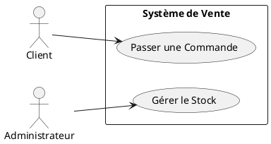
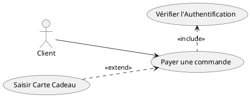
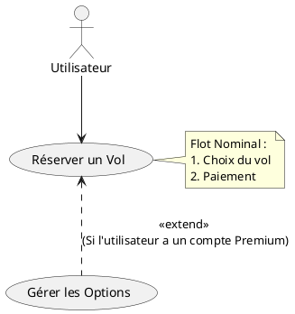
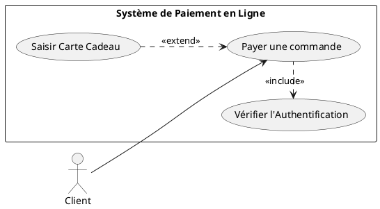

## 📝 Fiche de Syntaxe PlantUML : Diagramme de Cas d'Utilisation

L'objectif principal est de délimiter le **périmètre fonctionnel** du système et de visualiser l'interaction entre les **Acteurs** et les **Cas d'Utilisation**.

### 1\. Déclaration des Éléments de Base

| Élément UML | Syntaxe PlantUML | Description |
| :--- | :--- | :--- |
| **Début/Fin** | `@startuml` / `@enduml` | Délimite le code du diagramme. |
| **Système** | `left to right direction` / `rectangle NomDuSystème { ... }` | Définit le périmètre (la **boîte**) du système étudié. |
| **Acteur** | `:Nom de l'Acteur:` ou `actor Nom de l'Acteur` | Crée le bonhomme allumette (l'entité externe). |
| **Cas d'Utilisation** | `(Nom du Cas d'Utilisation)` ou `usecase Nom` | Crée l'ovale représentant une fonctionnalité. |
| **Association** | `Acteur --> (Cas d'Utilisation)` | Lien d'interaction simple (un trait). |

#### 💻 Code PlantUML : Acteurs et Cas d'Utilisation

-----

### 2\. Relations entre Cas d'Utilisation

Les relations $<<include>>$ et $<<extend>>$ sont cruciales pour structurer les flots d'événements.

| Relation UML | Syntaxe PlantUML | Symbole/Flèche | Sémantique |
| :--- | :--- | :--- | :--- |
| **Inclusion** ($<<include>>$) | `(UC_Base) .up.> (UC_Inclus) : <<include>>` | Flèche pointillée vers le cas inclus. | **Obligatoire** : réutilise un comportement. |
| **Extension** ($<<extend>>$) | `(UC_Extension) .down.> (UC_Base) : <<extend>>` | Flèche pointillée vers le cas de base. | **Conditionnel** : gère un cas spécial. |

**Note :** Vous pouvez utiliser `up`, `down`, `left` ou `right` pour diriger la flèche, ou laisser PlantUML le gérer par défaut. La direction est essentielle pour la lisibilité.

#### 💻 Code PlantUML : Inclusion et Extension

-----

### 3\. Annotation et Note (Bonus)

Pour documenter graphiquement les éléments ou ajouter des conditions (`<<extend>>` est souvent conditionnel).

| Élément UML | Syntaxe PlantUML | Description |
| :--- | :--- | :--- |
| **Note** | `note right of (UC) : Texte de la note` | Ajoute un commentaire directement sur le diagramme. |
| **Condition** | `Gift .> Pay : <<extend>> \n(si carte cadeau disponible)` | Utilise `\n` pour forcer un retour à la ligne sur le libellé de la relation. |

#### 💻 Code PlantUML : Annotation

Ce type de diagramme est excellent pour le **début de cycle** afin de valider les **besoins** avec les métiers, comme vous l'avez indiqué dans votre cours.

En PlantUML, pour représenter la **frontière du système** (le **périmètre** fonctionnel  du système) qui entoure les Cas d'Utilisation et les sépare des Acteurs, on utilise l'élément `rectangle`.

-----

## 💻 Syntaxe pour la Fenêtre du Système (`rectangle`)

Le mot-clé `rectangle` vous permet de dessiner une boîte autour de vos Cas d'Utilisation.

| Élément | Syntaxe PlantUML | Description |
| :--- | :--- | :--- |
| **Boîte/Système** | `rectangle "Nom du Système" { ... }` | Crée la frontière graphique du système analysé. |
| **Contenu** | Placer les Cas d'Utilisation (`usecase` ou parenthèses) à l'intérieur des accolades `{}`. | Seuls les Cas d'Utilisation se trouvent **dans** la boîte ; les Acteurs restent **à l'extérieur**. |
| **Orientation** | `left to right direction` | Améliore la lisibilité pour que les Acteurs soient à gauche. |

-----

### Exemple Complet

Voici comment intégrer le `rectangle` dans l'exemple que nous avions précédemment :

**Conclusion :** Le `rectangle` est la manière la plus courante et la plus claire en PlantUML pour modéliser le **périmètre fonctionnel** de votre système dans un Diagramme de Cas d'Utilisation.
