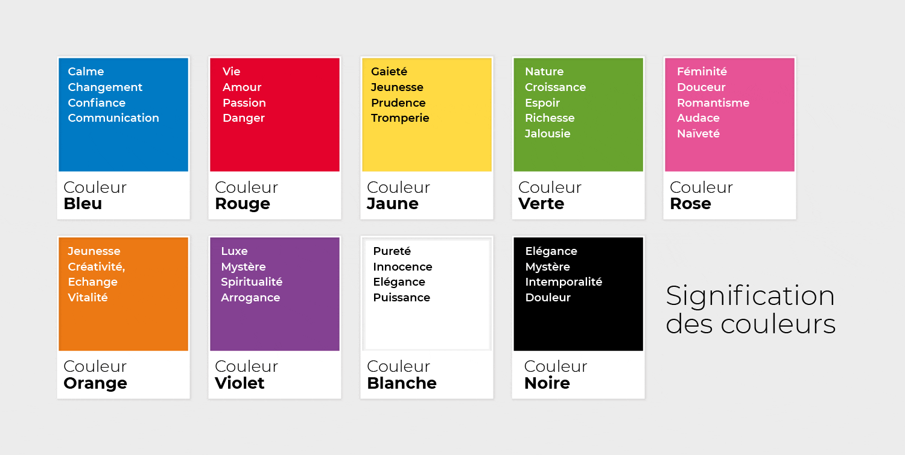

# La philosophie des couleurs en webdesign

## Introduction

Les couleurs sont un outil de communication.

Avant même de lire un texte, un utilisateur perçoit déjà une ambiance visuelle. Les couleurs servent à :

- transmettre une identité
- créer une atmosphère
- orienter l'attention
- hiérarchiser l'information
- faciliter la navigation

Dans le design et le marketing, elles portent souvent des associations psychologiques fortes. Ces associations ne sont pas absolues, car elles dépendent aussi de la culture et du contexte.



Source de l'image : [graphicstyle.fr](https://www.graphicstyle.fr/communication/signification-des-couleurs/)

## Signification générale des couleurs

### Rouge

Le rouge est souvent associé à :

- la passion
- l'énergie
- l'urgence
- la puissance

En design, il :

- attire immédiatement l'oeil
- crée un sentiment d'urgence
- stimule l'action

On l'utilise souvent pour :

- les promotions
- les boutons d'action
- les alertes

Utilisé en excès, il peut aussi générer une sensation d'agressivité visuelle.

### Bleu

Le bleu est souvent associé à :

- la confiance
- le sérieux
- la sécurité
- la technologie

C'est l'une des couleurs les plus utilisées sur le web, car elle inspire :

- la stabilité
- le professionnalisme
- la fiabilité

On la retrouve fréquemment dans :

- les banques
- les assurances
- les entreprises technologiques
- les réseaux professionnels

### Vert

Le vert évoque souvent :

- la nature
- la croissance
- la santé
- l'équilibre

Il est fréquent dans les univers liés à :

- l'écologie
- l'alimentation
- le bien-être
- la finance

Il peut aussi symboliser :

- la réussite
- l'argent
- la validation

### Jaune

Le jaune est souvent associé à :

- la joie
- l'optimisme
- l'énergie
- la créativité

Il attire facilement l'attention, mais il doit être utilisé avec précaution :

- en grande quantité, il fatigue l'oeil
- sur certains fonds, il devient difficile à lire

### Orange

L'orange évoque souvent :

- l'enthousiasme
- le dynamisme
- la convivialité

Il est très utilisé pour :

- les call-to-action
- les boutons
- les offres promotionnelles

Il combine une partie de l'énergie du rouge et de la chaleur du jaune.

### Violet

Le violet est souvent associé à :

- la créativité
- l'imagination
- le mystère
- le luxe

On le retrouve souvent dans :

- les marques créatives
- les univers artistiques
- les produits premium

### Noir

Le noir évoque souvent :

- l'élégance
- le luxe
- la sobriété
- la puissance

Il est fréquent dans :

- la mode
- les marques haut de gamme
- les produits premium

Il peut contribuer à un design minimaliste et sophistiqué.

### Blanc

Le blanc est souvent associé à :

- la pureté
- la simplicité
- le minimalisme
- la clarté

En webdesign, il sert surtout à créer :

- de l'espace
- de la respiration
- de la lisibilité

On parle souvent d'**espace blanc**. Ce n'est pas un vide inutile, mais un élément essentiel de la composition.

## Une règle importante : éviter le noir et le blanc purs

Dans un design system professionnel, on évite presque toujours :

```text
#000000
#FFFFFF
```

Pourquoi ? Parce que leur contraste est souvent trop brutal à l'écran.

Un noir pur sur un blanc pur peut fatiguer visuellement, surtout sur de longues lectures.

On préfère souvent utiliser :

### Des faux noirs

Exemples :

```text
#222222
#1A1A1A
#333333
```

### Des faux blancs

Exemples :

```text
#F5F5F5
#FAFAFA
#F8F8F8
```

Ces nuances créent :

- un contraste suffisant
- une lecture plus confortable
- une interface plus douce

## Les couleurs complémentaires

Les couleurs complémentaires sont situées à l'opposé sur le cercle chromatique.

Exemples :

| Couleur | Complémentaire |
| --- | --- |
| bleu | orange |
| rouge | vert |
| jaune | violet |

Pourquoi les utiliser ?

Parce qu'elles créent :

- un contraste naturel
- une bonne lisibilité
- une forte visibilité des éléments importants

Exemple classique :

- fond bleu
- bouton orange

Le bouton ressort immédiatement.

## Construire une palette de couleurs

Une palette efficace utilise souvent :

- une couleur principale
- une couleur secondaire
- une couleur d'accent
- plusieurs nuances neutres

Exemple :

- couleur principale : bleu
- couleur secondaire : violet
- accent : orange
- neutres : gris

Cela permet de :

- créer une identité
- guider l'attention
- éviter la confusion visuelle

## Outils pour créer une palette

Un outil très utilisé est **Adobe Color** :

- https://color.adobe.com

Il permet notamment de :

- visualiser une roue chromatique
- générer des palettes
- tester différentes harmonies
- vérifier certains contrastes

Types d'harmonies fréquents :

- monochromatique
- analogue
- complémentaire
- triadique

## Accessibilité et contraste

Un design doit rester lisible pour tous les utilisateurs.

Les normes WCAG imposent des ratios de contraste minimum.

| Type de texte | Contraste minimum |
| --- | --- |
| texte normal | 4.5:1 |
| texte large | 3:1 |

Exemple :

- texte gris clair sur fond blanc : contraste insuffisant
- texte sombre sur fond clair : lisibilité correcte

### Outils de vérification

Quelques outils utiles :

- WebAIM Contrast Checker
- Adobe Color
- des extensions d'accessibilité pour navigateur

Ils permettent de vérifier :

- la lisibilité
- l'accessibilité
- la conformité aux normes

## Résumé

Un bon choix de couleurs repose sur trois principes :

1. la signification émotionnelle
2. le contraste et la lisibilité
3. la cohérence dans le design system

Un design efficace n'utilise pas :

- trop de couleurs
- des contrastes agressifs
- du noir ou du blanc pur partout

Il utilise plutôt :

- une palette limitée
- des nuances bien choisies
- des contrastes maîtrisés
