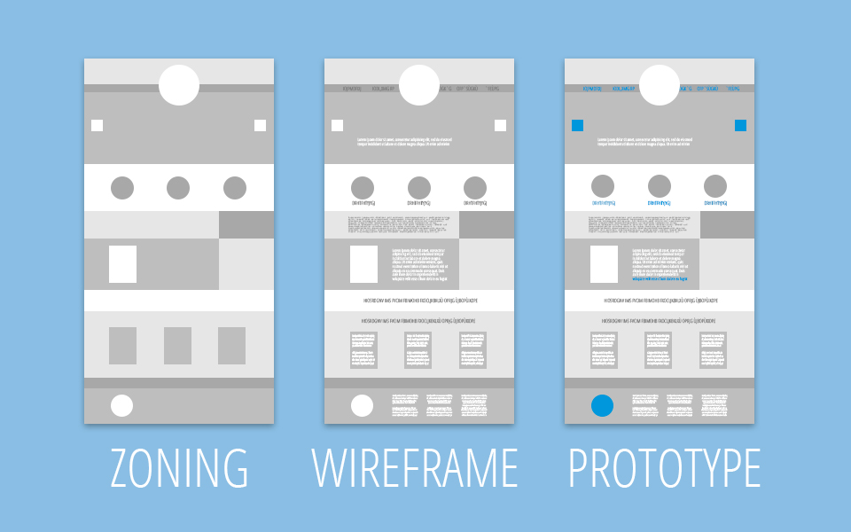
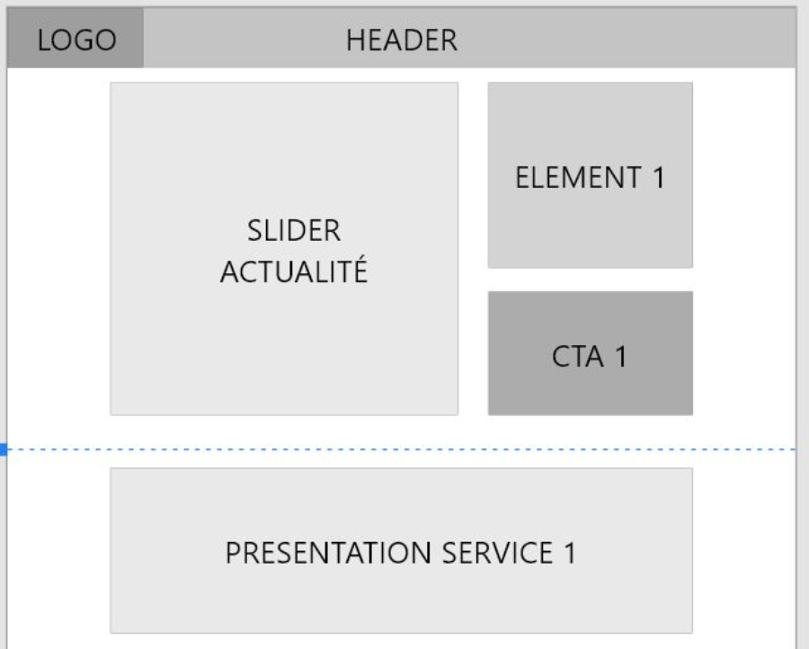
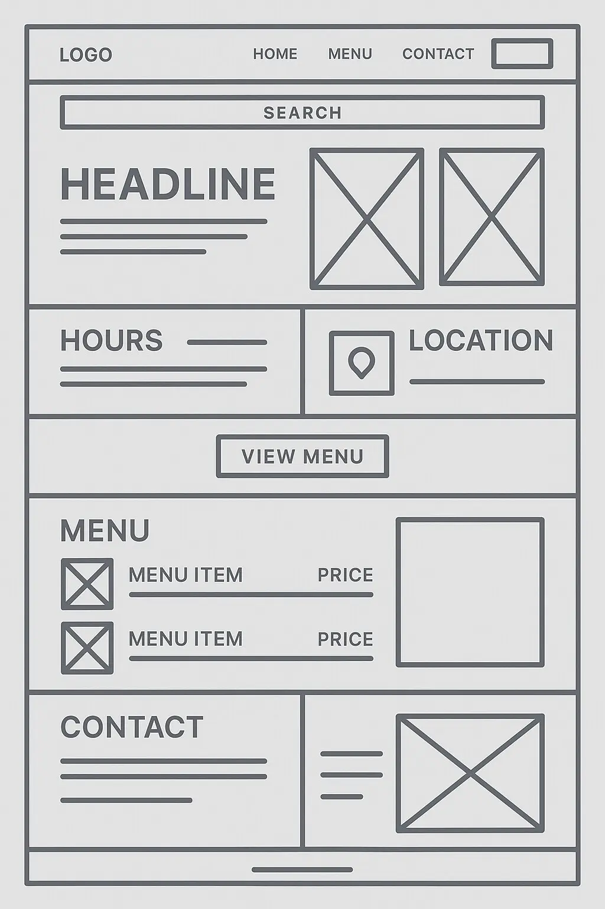

# Le webdesign : organiser l'information avant de penser au visuel

## Introduction

Le webdesign est souvent perçu comme une discipline purement esthétique : couleurs, typographies, images, animations.

En réalité, c'est d'abord une discipline d'organisation de l'information et d'expérience utilisateur.

Pour un développeur, le moment du webdesign est aussi le moment où il commence à réfléchir :

- à la structure de l'application
- à la navigation
- à la logique des pages
- parfois même à l'organisation future du code

Un bon design n'est donc pas seulement beau. Il est aussi :

- compréhensible
- rapide à utiliser
- efficace pour atteindre un objectif

Autrement dit, c'est un design qui rend service à l'utilisateur.

## Les grandes étapes de conception

La conception d'une interface suit généralement plusieurs étapes. Elles permettent de passer progressivement d'une idée abstraite à une interface concrète et testable.

Ordre classique :

0. fonctionnalités, contexte et personae
1. moodboard
2. charte graphique
3. zoning
4. wireframe
5. maquette
6. prototype interactif

Chaque étape répond à une question différente.

## 0. Fonctionnalités, contexte et personae

Avant de travailler le visuel, il faut comprendre :

- les fonctionnalités du site ou de l'application
- le contexte du projet
- les utilisateurs visés

Le contexte change fortement la manière de travailler.

Exemples :

- un site vitrine demande moins de travail qu'une application complexe
- un MVP impose souvent d'aller à l'essentiel
- un projet avec peu de budget oblige à simplifier certaines phases

Les personae permettent d'identifier les caractéristiques des utilisateurs.

Exemple : si le site s'adresse à un public peu à l'aise avec le numérique, il faut éviter :

- les interfaces trop chargées
- les parcours compliqués
- les visuels trop abstraits

Ressource Figma :

- https://www.figma.com/fr-fr/resource-library/how-to-create-a-persona/

## 1. Le moodboard

Le moodboard est un tableau d'inspiration visuelle.

On y rassemble :

- des couleurs
- des interfaces intéressantes
- des typographies
- des styles graphiques
- des idées de navigation
- des compositions visuelles

L'objectif n'est pas de copier, mais de comprendre ce qui fonctionne.

Exemples d'éléments :

- capture d'écran d'un site avec une navigation efficace
- palette de couleurs cohérente
- exemple de carte produit
- style d'illustration

Le point important est d'expliquer **pourquoi** on retient certains éléments.

Exemples d'analyse :

> Ce site utilise un menu simple avec quatre entrées, ce qui rend la navigation rapide.

> Cette palette combine une couleur dominante et une couleur d'accent pour guider l'oeil vers les actions importantes.

> Ce design utilise beaucoup d'espace blanc, ce qui améliore la lisibilité.

Cette étape aide à formuler les attentes du projet :

- navigation rapide
- lisibilité
- hiérarchie visuelle
- efficacité de l'information
- sentiment de confiance
- modernité

Ressource Figma :

- https://www.figma.com/resource-library/how-to-make-a-mood-board/

## 2. La charte graphique

La charte graphique transforme les pistes du moodboard en décisions visuelles plus stables.

Elle définit les règles visuelles du projet.

Elle contient souvent :

### La palette de couleurs

```text
Couleur principale : #1E88E5
Couleur secondaire : #FFC107
Couleur de texte : #333333
Couleur de fond : #F5F5F5
```

### Les typographies

```text
Titre : Poppins
Texte : Roboto
Code : Fira Code
```


### Les styles d'interface

Par exemple :

- boutons
- cartes
- formulaires
- icônes
- espacements

À ce stade, on commence souvent à parler de **design system** : un ensemble de composants réutilisables et de règles communes.

Exemples de composants :

- boutons
- cartes
- champs
- alertes
- modales

Ressource Figma :

- https://www.figma.com/blog/design-systems-101-what-is-a-design-system/

## 3. Le zoning



Le zoning consiste à organiser l'information par blocs.

On ne s'occupe pas encore du style visuel détaillé. On se pose surtout les questions suivantes :

- quelles informations apparaissent sur la page ?
- quelles informations sont prioritaires ?
- quelles sections existent ?
- dans quel ordre doivent-elles apparaître ?

Exemple :



Le zoning permet de réfléchir à :

- la hiérarchie de l'information
- la navigation
- la structure des pages

C'est aussi un bon moment pour réfléchir au responsive design.

Exemple :

- version desktop : 3 colonnes
- version mobile : 1 colonne

## 4. Le wireframe

Le wireframe est une maquette simplifiée de l'interface.

Contrairement au zoning, on commence à préciser :

- la position des textes
- la position des images
- les boutons
- les formulaires



Mais on reste volontairement très simple visuellement.

Un wireframe est souvent :

- en noir et blanc
- avec du faux texte
- avec des placeholders d'images

Exemple :

```text
[ IMAGE ]

Titre de section

Lorem ipsum dolor sit amet...

[Bouton]
```

Pourquoi ? Parce que cela permet de détecter rapidement les problèmes de structure.

Si une interface semble confuse en noir et blanc, elle ne deviendra pas claire simplement en ajoutant :

- des images
- des couleurs
- des animations

Le wireframe permet donc de corriger les erreurs de logique avant d'investir du temps dans le design visuel.

## 5. La maquette

La maquette consiste à appliquer le design graphique au wireframe.

On ajoute :

- les couleurs
- les typographies
- les images
- les icônes
- les styles visuels

La maquette correspond généralement à ce que l'utilisateur verra réellement.

Exemples d'outils :

- Figma
- Adobe XD
- Sketch
- Canva pour des besoins plus simples

La maquette sert aussi de référence pour les développeurs.

## 6. Le prototype interactif

La dernière étape consiste à transformer la maquette en prototype interactif.

Le prototype permet :

- de cliquer sur les boutons
- de naviguer entre les pages
- de tester les interactions

Cela permet aux utilisateurs, aux clients ou à l'équipe de se projeter dans l'usage réel du produit.

Exemples :

- cliquer sur `Connexion`
- ouvrir un menu
- simuler un formulaire

## Pourquoi ces étapes sont importantes

Modifier un design dans un outil comme Figma prend souvent quelques minutes.

Modifier ce même choix une fois intégré dans le code peut prendre :

- plusieurs heures
- parfois plusieurs jours

C'est pour cela qu'il vaut mieux corriger les problèmes le plus tôt possible.

Plus on avance dans le projet, plus le coût du changement augmente.

| Étape | Coût |
| --- | --- |
| zoning | très faible |
| wireframe | faible |
| maquette | moyen |
| code | élevé |
| production | très élevé |

## Durée réelle de ces phases

Contrairement à une idée fréquente, ces étapes peuvent prendre du temps.

Selon la taille du projet :

| Type de projet | Durée |
| --- | --- |
| petit site | quelques jours |
| site classique | quelques semaines |
| grosse application | plusieurs mois |

Chaque étape implique souvent :

- des retours client
- des tests
- des ajustements

## Exemple concret

Projet : site d'une salle de sport.

### Moodboard

- interfaces fitness
- couleurs dynamiques
- photos sportives

### Zoning

```text
Hero
Offres
Planning des cours
Coach
Avis clients
Inscription
```

### Wireframe

- placement des cartes
- position des images
- formulaire d'inscription

### Maquette

- couleurs sportives
- photos
- boutons

### Prototype

- inscription
- navigation dans le planning
- réservation de cours

## Résumé

Le webdesign suit une progression logique :

1. comprendre le besoin
2. structurer l'information
3. clarifier les parcours
4. construire la forme visuelle
5. tester avant de développer

Plus les problèmes sont identifiés tôt, plus le projet gagne en temps, en qualité et en clarté.
